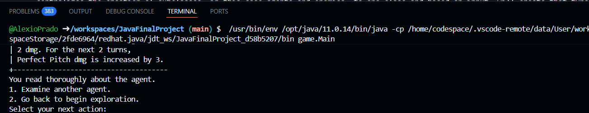

# Hollow Exploration
You are tasked to create a team of two and explore the Mii hollow that has ravaged the new district. Fight against enemies in a turn based game and survive for as long as you can.

## How To Run
1. Download ZIP file and unzip
2. Place into your IDE. Preferrable Github codespace
3. Download Extensions for Java
4. Right click Main.java, found in game folder, click run java file
5. If asked to use standard mode in a popup on the bottom right, allow and wait untill application runs

## MVC Structure
### Model
Contains files of the agent and enemy abstract class, with several subclasses of different agents and enemies. agentFactory and enemyFactory classes are utilized to create agent and enemy objects from one place.

### View
gameView class contains many method to output structures for information of agents, menu, end game, battle interface, and a template for showcasing a user's choices. 

### Controller
Contains the game flow of the project and interactions between agent and enemy classes.

## Factory Design Pattern
With so many subclasses of agents and enemies that behave differently, creating a factory pattern was the best choice. It centralizes the creation of subclasses, in this case agents and enemies, to one class and based on input, will create that type of object. the agent and enemy abstract parent classes have set values that each subclass needs, then allows for methods to be overided based on the needs of the agent and enemy. This can be seen especially for agents with different normal, skill, and ultimate attack effects. 

## Mediator Design Pattern
An agent subclass called agentSunna increases the dmg of agents in their party. In order for her dmg bonus to be added to her partner, she communicates with the gameController to send new information of the buffs duration, dmg, and max duration. Same goes to agentAria which increases energy for her other agent and agentNangong that stuns the enemy, needing information of the enemy to be stunned and vice versa.

## Running Test Suite
I do not unfortunately have the right set up to run test suite anywhere except Eclipse. Download and unzip the files, then import to Eclipse and run all tests in the project. I apologize for the inconvenience.

## AI Usage
I used AI in the process of creating ideas in the use of the MVC structure as well as solving bugs. No code was created by AI.

## Known Issues & Limitations

1. Aesthetics of Application: When running the application under Github Codespace(Most likley VSCode too), the command to run the game covers some of the text. Right click the command to disable sticky scroll. 

